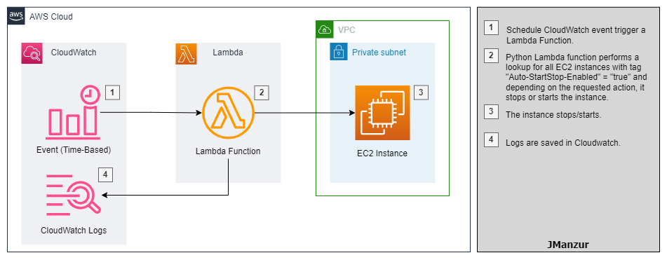
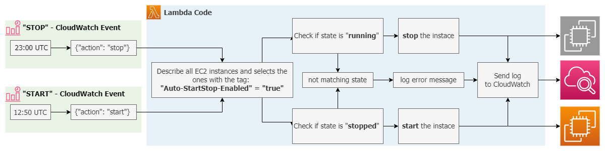

# Starting and Stopping EC2 instances using a Lambda function [Full Demo]

In order to save cost on computing resources, it is good practice to stop non-production EC2 instances during non-business hours. To achieve that, this solution will implement a python lambda function triggered by a CloudWatch schedule event, the lambda function will perform a lookup on all EC2 instances of the AWS account with the tag "Auto-StartStop-Enabled" = "true", and those that match the criteria will be stop/start.

> :bulb: Are you interested in the same type of solution for RDS? check [this repo](https://github.com/JManzur/StartStopRDS)



### **Resources deployed by this manifest**:
- Demo EC2 instance with tag "Auto-StartStop-Enabled" = "true".
- Demo Security Group to allow SSH into the EC2 instance.
- IAM Policy and role to allow the lambda function to Describe, Start and Stop the EC2 instances, and also send logs to CloudWatch.
- Python Lambda function. 
- CloudWatch event rule to STOP EC2 instances from monday to friday at 19:00 EST.
- CloudWatch event rule to START EC2 instances from monday to friday at 08:50 EST.

### **Lambda function details**:

**IMPORTANT**: Please note that all schedule CloudWatch events use UTC time (GMT +0)
- 23:00 UTC = 19:00 EST
- 12:50 UTC = 08:50 EST



## Tested with: 

| Environment | Application | Version  |
| ----------------- |-----------|---------|
| WSL2 Ubuntu 20.04 | Terraform | v1.2.1  |
| WSL2 Ubuntu 20.04 | aws-cli | v2.5.3  |
| Lambda Code | Python | v3.9  |

## Initialization How-To:

Located in the root directory, make an "aws configure" to log into the aws account, and a "terraform init" to download the necessary modules and start the backend.

```bash
aws configure
terraform init
```

## Deployment How-To:

Located in the root directory, make the necessary changes in the variables.tf file and run the manifests:

> :warning: Since this is just a demo, all CloudWatch events are disabled, to enable it, change the variable "enable_event_rules" to "true" (without quotes)

```bash
terraform apply
```

## Debugging / Troubleshooting:

To test the lambda function you can use the following "testing event":

Start test:
```json
{
  "action": "start"
}
```

Stop test:
```json
{
  "action": "stop"
}
```


## Documentation:

- [AWS Official Approach](https://aws.amazon.com/es/premiumsupport/knowledge-center/start-stop-lambda-cloudwatch/)
- [Python SDK documentation for EC2](https://boto3.amazonaws.com/v1/documentation/api/latest/reference/services/ec2.html)